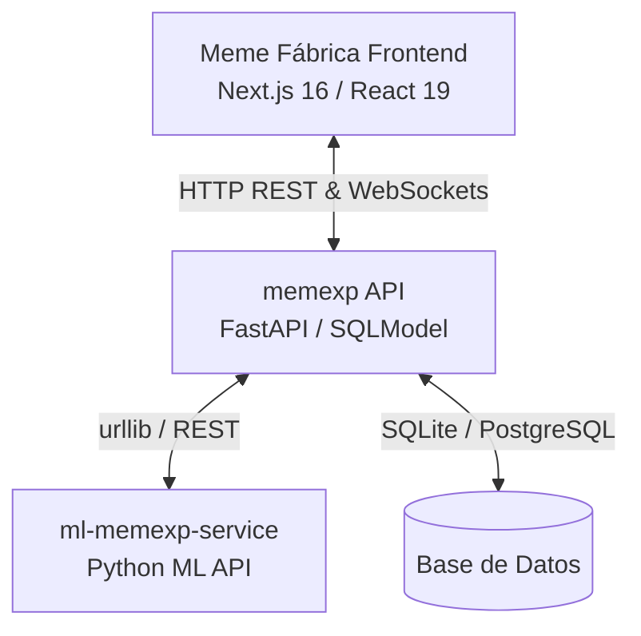

# 🏭 Meme Fábrica App

**Meme Fábrica App** es una plataforma moderna e interactiva de gestión de producción, planta y planificación (sistema MES - *Manufacturing Execution System*) diseñada para coordinar, monitorear y optimizar los flujos de trabajo de fabricación de memes. 

El proyecto consta de una arquitectura moderna dividida en una aplicación cliente en **Next.js 16** y una API de servicios en **FastAPI (memexp)** que, a su vez, conecta con un **servicio de Machine Learning** interno para el análisis predictivo.

---

## 🏗️ Arquitectura General

La comunicación entre los componentes principales sigue un patrón desacoplado y orientado a servicios:



### Componentes de la Arquitectura
1. **Frontend (`meme-fabrica-app`)**: Interfaz de usuario rica y reactiva desarrollada con Next.js y React 19. Gestiona el estado de planta, órdenes de producción, inventario de insumos, operarios y visualización de proyecciones mediante dashboards dinámicos.
2. **Backend API (`memexp`)**: Servicio central desarrollado en Python con FastAPI. Encargado de la lógica de negocio, validaciones transaccionales (como control de inventario al crear órdenes), autenticación de usuarios y canal de actualizaciones en tiempo real usando WebSockets.
3. **Servicio ML (`ml-memexp-service`)**: Backend especializado en inteligencia artificial que procesa datos históricos de producción para generar estimaciones de tiempos de entrega, cuellos de botella y simulación de escenarios de carga.

---

## 🛠️ Stack Tecnológico

### Frontend (`meme-fabrica-app`)
*   **Framework**: Next.js 16.1.6 (App Router)
*   **Biblioteca**: React 19.2.3 (optimizado con `babel-plugin-react-compiler` habilitado)
*   **Lenguaje**: TypeScript 5.x
*   **Estilos**: Tailwind CSS v4
*   **Estado Global**: Zustand 5.x (almacenes desacoplados por funcionalidad)
*   **Formularios**: React Hook Form 7.x + Zod 4.x para validaciones estrictas en cliente
*   **Visualizaciones**: Recharts (gráficos interactivos) y Lucide React (iconografía)

### Backend (`memexp`)
*   **Framework**: FastAPI (Python)
*   **ORM**: SQLModel (fusión moderna entre SQLAlchemy y Pydantic)
*   **Base de datos**: SQLite para desarrollo local / PostgreSQL para entornos productivos
*   **Seguridad**: OAuth2 con flujo de Password Bearer y JWT
*   **Tiempo Real**: WebSockets nativos de FastAPI para notificaciones de eventos instantáneas

---

## ⚡ Estructura del Proyecto Frontend

La aplicación cliente sigue una **Arquitectura Basada en Características (Feature-Driven Architecture)**, aislando los dominios de negocio:

*   `src/app/`: Estructura del App Router de Next.js (rutas, layouts y puntos de entrada). Contiene el grupo de rutas protegidas `(protected)` para áreas autenticadas.
*   `src/features/`: Lógica central del dominio de negocio. Cada subcarpeta (ej. `dashboard`, `insumos`, `ordenes`, `ia-predictiva`) contiene sus propios:
    *   `components/`: Componentes visuales específicos de la característica.
    *   `schemas/`: Esquemas de validación Zod (`*.schema.ts`).
    *   `services/`: Servicios y llamadas a endpoints específicos de la API (`*.service.ts`).
    *   `store/`: Estado global de Zustand (`use*Store.ts`).
*   `src/components/`: Componentes globales y reutilizables de UI (cabeceras, modales genéricos, botones).
*   `src/services/`: Clientes y configuración global para API.
*   `src/shared/`: Constantes y definiciones compartidas a nivel de dominio.
*   `src/utils/`: Funciones de utilidad y formateadores.

---

## 🔌 API de `memexp` (FastAPI) - Detalle de Endpoints

La API de backend `memexp` expone las siguientes rutas y lógica de integración:

### 1. Autenticación (`/auth`)
*   `POST /auth/token`: Emisión de JWT mediante credenciales del usuario.
*   `GET /auth/me`: Retorna los detalles y el rol del usuario autenticado.

### 2. Gestión de Insumos (`/insumos`)
*   `GET /insumos`: Lista de insumos y materias primas disponibles en inventario.
*   `POST /insumos`: Registro de nuevos insumos en planta.
*   `GET /insumos/{id}` / `PUT /insumos/{id}` / `DELETE /insumos/{id}`: CRUD y actualización de stocks.

### 3. Gestión de Planta (Operarios & Máquinas)
*   `/operarios`: Control de personal en planta (estado activo/inactivo, turnos, perfiles).
*   `/maquinas`: Catálogo de hardware y equipos de impresión/producción.

### 4. Órdenes de Producción (`/ordenes`)
*   `GET /ordenes`: Listado de todas las órdenes en cola.
*   `POST /ordenes`: Creación de una nueva orden. Realiza validación transaccional automática de stock de insumos y autogenera el identificador secuencial (ej. `OPMTO10` para Make-to-Order u `OPMTS12` para Make-to-Stock).
*   `/asignaciones`: Relaciona operarios y máquinas con líneas de producción específicas de una orden.

### 5. Reportes & Seguimiento
*   `/reportes_avance`: Registro de hitos y cantidad de piezas terminadas por línea.
*   `/reportes_averia`: Notificación de fallas de maquinaria y solicitudes de mantenimiento correctivo.

### 6. Módulo de IA Predictiva (`/ia`)
Los endpoints de este módulo actúan como un proxy que interactúa con el servicio interno de ML (`ml-memexp-service`):
*   `GET /ia/projections`: Obtiene proyecciones semanales y mensuales estimadas de rendimiento de producción.
*   `GET /ia/bottlenecks`: Analiza las colas de trabajo activas para identificar cuellos de botella y ofrece sugerencias de balanceo.
*   `POST /ia/simulate-mts`: Simula el impacto de insertar un pedido planificado del tipo MTS (Make to Stock) sobre la cola MTO (Make to Order) en ejecución.
*   `POST /ia/train` *(Solo Admin)*: Lanza el reentrenamiento del modelo predictivo utilizando nuevos datos históricos.
*   `POST /ia/seed` *(Solo Admin)*: Siembra datos simulados e históricos en la base de datos para pruebas.

### 7. Canal en Tiempo Real (`WebSocket`)
*   `ws://[host]/ws/updates`: Canal WebSocket por donde el backend transmite eventos clave (como `order_created`, reportes de avance y averías) para mantener sincronizados los paneles de todos los usuarios conectados.

---

## ⚙️ Configuración y Variables de Entorno

Para habilitar la comunicación entre la aplicación Next.js y la API FastAPI, configure el archivo `.env.local` en la raíz del frontend:

```env
# URL base de la API FastAPI
NEXT_PUBLIC_API_URL=http://localhost:8000
```

---

## 🚀 Inicio Rápido

1.  **Instalar dependencias del frontend**:
    ```bash
    pnpm install
    ```
2.  **Iniciar el servidor de desarrollo**:
    ```bash
    pnpm run dev
    ```
3.  **Acceso a la plataforma**:
    Abre [http://localhost:3000](http://localhost:3000) en tu navegador preferido.
